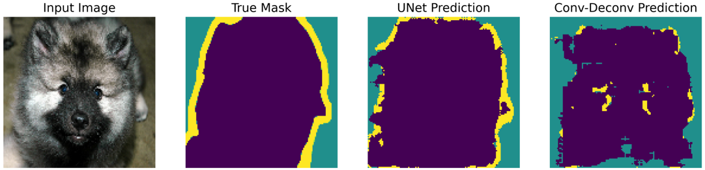
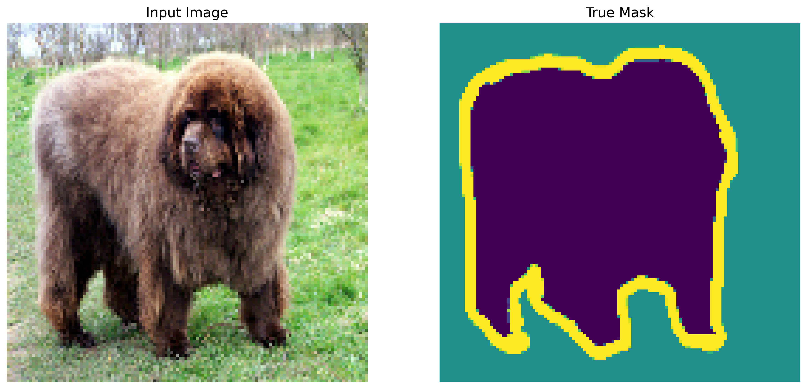
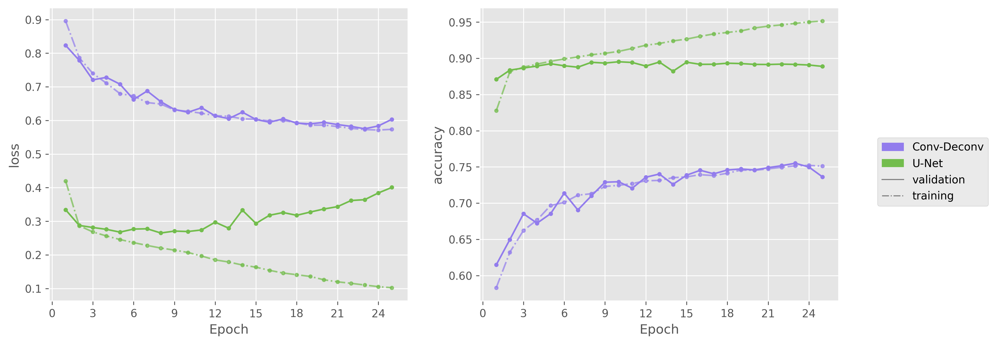
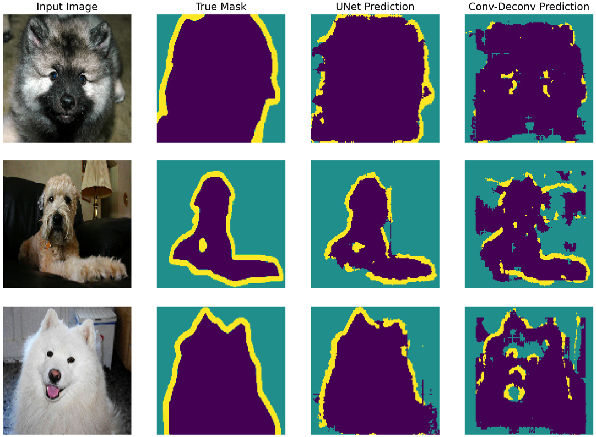

<h1 align = "center"> Pet image segmentation </h1>

[![MIT License][license-shield]][license-url]
[![LinkedIn][linkedin-shield]][linkedin-url]

<p align="center">
    
</p>

The task of an image classification network is to assign a label to the input image. It is not possible to know where in the image and how big the object is. One of the solutions to tackle this task is to design a pixel-wise classification system. Each pixel of the input image is given a label. However, as always in machine learning, data is crucial. The ground truth of the dataset used to train an image segmentation neural network cannot be a simple label. It has to be a mask that matches the size of the input image. The development of such a dataset requires a lot of human labor. Fortunately, there are some open-source datasets for us to experiment with. We will use the Oxford-IIIT dataset created by Parkhi et al. It consists of images of pet and a mask where each pixel is given one of three categories; pixel belonging to the pet, pixel bordering the pet or, surrounding pixel.

- [Import data](#import-data)
- [Build models](#build-models)
  - [Basic model](#basic-model)
  - [Custom U-Net](#custom-u-net)
- [Training](#training)
- [Evaluate](#evaluate)

<details>
    <summary>See package import cell</summary>

```python
import tensorflow as tf
gpus = tf.config.experimental.list_physical_devices('GPU')
# Limit GPU memory allocation for Conv2DTranspose execution
if gpus:
    try:
    # Currently, memory growth needs to be the same across GPUs
        for gpu in gpus:
            tf.config.experimental.set_memory_growth(gpu, True)
        logical_gpus = tf.config.experimental.list_logical_devices('GPU')
        print(len(gpus), "Physical GPUs,", len(logical_gpus), "Logical GPUs")
    except RuntimeError as e:
    # Memory growth must be set before GPUs have been initialized
        print(e)

import tensorflow_datasets as tfds
try:
    from tensorflow_examples.models.pix2pix import pix2pix
except:
    !pip install -q git+https://github.com/tensorflow/examples.git
    from tensorflow_examples.models.pix2pix import pix2pix
import numpy as np

import matplotlib.pyplot as plt
import matplotlib.patches as mpatches
from matplotlib.lines import Line2D
import matplotlib as mpl
from matplotlib.ticker import MaxNLocator
mpl.rcParams['figure.dpi'] = 300
plt.style.use('ggplot')
```

    1 Physical GPUs, 1 Logical GPUs
</details>

<details>
    <summary>See Util function definition</summary>

```python
def get_models_history(histories):
    fig, axs = plt.subplots(1, 2, figsize=(14,5))
    colors_graph = [
    "#927ced",
    "#73bd4d",
    "#e462c0",
    "#eb5e52"]
    handles = []
    for (model_name, history), color in zip(histories.items(), colors_graph):
        axs[0].plot(range(1, len(history.history['loss'])+1), history.history['loss'], c=color, ls='-.', alpha=.7, marker='o', ms=3)
        axs[0].plot(range(1, len(history.history['val_loss'])+1), history.history['val_loss'], label=model_name, c=color, marker='o', ms=3)
        axs[1].plot(range(1, len(history.history['accuracy'])+1), history.history['accuracy'], c=color, ls='-.', alpha=.7, marker='o', ms=3)
        axs[1].plot(range(1, len(history.history['val_accuracy'])+1), history.history['val_accuracy'], label=model_name, c=color, marker='o', ms=3)
        handles.append(mpatches.Patch(color=color, label=model_name))
    for ax in axs:
        ax.set_xlabel('Epoch')
        ax.xaxis.set_major_locator(MaxNLocator(integer=True))
    axs[0].set_ylabel('loss')
    axs[1].set_ylabel('accuracy')
    handles.append(Line2D([0], [0], color='grey', lw=1, ls='-', label='validation'))
    handles.append(Line2D([0], [0], color='grey', lw=1, ls='-.', label='training'))
    fig.subplots_adjust(right=0.85)
    fig.legend(handles=handles,
        loc="center right",
        borderaxespad=1)
    return fig

def display(display_list):
    plt.figure(figsize=(15, 15))

    title = ['Input Image', 'True Mask', 'UNet Prediction', 'Conv-Deconv Prediction']

    for i in range(len(display_list)):
        plt.subplot(1, len(display_list), i+1)
        plt.title(title[i])
        plt.imshow(tf.keras.preprocessing.image.array_to_img(display_list[i]))
        plt.axis('off')
    plt.show()

def create_mask(pred_mask):
    pred_mask = tf.argmax(pred_mask, axis=-1)
    pred_mask = pred_mask[..., tf.newaxis]
    return pred_mask[0]
```

</details>


## Import data


```python
def normalize(input_image, input_mask):
    input_image = tf.cast(input_image, tf.float32) / 255.0
    input_mask -= 1
    return input_image, input_mask

@tf.function
def load_image_train(datapoint):
    input_image = tf.image.resize(datapoint['image'], (128, 128))
    input_mask = tf.image.resize(datapoint['segmentation_mask'], (128, 128))

    if tf.random.uniform(()) > 0.5:
        input_image = tf.image.flip_left_right(input_image)
        input_mask = tf.image.flip_left_right(input_mask)

    input_image, input_mask = normalize(input_image, input_mask)

    return input_image, input_mask

@tf.function
def load_image_test(datapoint):
    input_image = tf.image.resize(datapoint['image'], (128, 128))
    input_mask = tf.image.resize(datapoint['segmentation_mask'], (128, 128))

    input_image, input_mask = normalize(input_image, input_mask)

    return input_image, input_mask
```


```python
dataset, info = tfds.load('oxford_iiit_pet:3.*.*', with_info=True)
TRAIN_LENGTH = info.splits['train'].num_examples
BATCH_SIZE = 32
BUFFER_SIZE = 1000
STEPS_PER_EPOCH = TRAIN_LENGTH // BATCH_SIZE

train = dataset['train'].map(load_image_train, num_parallel_calls=tf.data.experimental.AUTOTUNE)
test = dataset['test'].map(load_image_test)

train_dataset = train.cache().shuffle(BUFFER_SIZE).batch(BATCH_SIZE).repeat()
train_dataset = train_dataset.prefetch(buffer_size=tf.data.experimental.AUTOTUNE)
test_dataset = test.batch(BATCH_SIZE)

for image, mask in train.take(7):
    sample_image, sample_mask = image, mask
display([sample_image, sample_mask])
```


    

    


## Build models

We will use an encoder-decoder convolutional architecture. The main difference with a classical CNN is the format of the representation of information. We can consider that classification CNN are simple an encoder. They extracts the key features of the images relevant to classification. Then we were able to label images given these features. Now, we want to generate a mask as output. Again, the convolutional layer generates features that contain all the relevant information to building a mask. This is the encoder. The decoder shapes the encoded information, the features, into a mask. We can use the transposed convolution (also called deconvolution) to scale up the dimensional of our data flow to match the mask size. The stride of the deconvolution defined the upscaling factor (given a dilation rate of 1). We will need a couple of deconvolution layers with a stride of 2 to compensate for the dimension reduction due to the encoder.

| Layer type | Output Shape | Number of parameters |
| -: | :-: | :-: |
|    Conv2D | (64, 64, 16)  | 448 |
|    Conv2D | (64, 64, 32)  | 4640 |
|    MaxPooling2D | (32, 32, 16)  | 0 |
|    Conv2D | (32, 32, 64)  | 18496 |
|    Conv2DTranspose | (64,64,64) | 102464 |
|    Conv2DTranspose | (128,128,3) | 1731 |

### Basic model

```python
basic_model = tf.keras.Sequential(
    [
        tf.keras.layers.Input(shape=(128,128,3)),
        tf.keras.layers.Conv2D(filters=16, kernel_size=(3, 3), strides=2, activation="relu", padding="same"),
        tf.keras.layers.Conv2D(filters=32, kernel_size=(3, 3), strides=1, activation="relu", padding="same"),
        tf.keras.layers.MaxPooling2D(pool_size=(2, 2)),
        tf.keras.layers.Conv2D(filters=64, kernel_size=(3, 3), strides=1, activation="relu", padding="same"),
        tf.keras.layers.Conv2DTranspose(filters=64, kernel_size=(3, 3), strides=2, activation="relu", padding="same"),
        tf.keras.layers.Conv2DTranspose(filters=3, kernel_size=(3, 3), strides=2, padding="same")
    ]
)
basic_model.summary()
```
<details>
    <summary>See model resume</summary>

    Model: "sequential"
    _________________________________________________________________
    Layer (type)                 Output Shape              Param #   
    =================================================================
    conv2d (Conv2D)              (None, 64, 64, 16)        448       
    _________________________________________________________________
    conv2d_1 (Conv2D)            (None, 64, 64, 32)        4640      
    _________________________________________________________________
    max_pooling2d (MaxPooling2D) (None, 32, 32, 32)        0         
    _________________________________________________________________
    conv2d_2 (Conv2D)            (None, 32, 32, 64)        18496     
    _________________________________________________________________
    conv2d_transpose (Conv2DTran (None, 64, 64, 64)        36928     
    _________________________________________________________________
    conv2d_transpose_1 (Conv2DTr (None, 128, 128, 3)       1731      
    =================================================================
    Total params: 62,243
    Trainable params: 62,243
    Non-trainable params: 0
    _________________________________________________________________

</details>
    
### Custom U-Net


```python
encoder_model = tf.keras.applications.MobileNetV2(input_shape=[128, 128, 3], include_top=False)

# Use the activations of these layers
layer_names = [
    'block_1_expand_relu',   # 64x64
    'block_3_expand_relu',   # 32x32
    'block_6_expand_relu',   # 16x16
    'block_13_expand_relu',  # 8x8
    'block_16_project',      # 4x4
]
encoder_model_outputs = [encoder_model.get_layer(name).output for name in layer_names]

# Create the feature extraction model
encoder_stack = tf.keras.Model(inputs=encoder_model.input, outputs=encoder_model_outputs)

encoder_stack.trainable = False

decoder_stack = [
    pix2pix.upsample(512, 3),  # 4x4 -> 8x8
    pix2pix.upsample(256, 3),  # 8x8 -> 16x16
    pix2pix.upsample(128, 3),  # 16x16 -> 32x32
    pix2pix.upsample(64, 3),   # 32x32 -> 64x64
]


inputs = tf.keras.layers.Input(shape=[128, 128, 3])
# Downsampling through the model
skips = encoder_stack(inputs)
x = skips[-1]
skips = reversed(skips[:-1])

# Upsampling and establishing the skip connections
for up, skip in zip(decoder_stack, skips):
    x = up(x)
    concat = tf.keras.layers.Concatenate()
    x = concat([x, skip])

# This is the last layer of the model
last = tf.keras.layers.Conv2DTranspose(
  3, 3, strides=2,
  padding='same')  #64x64 -> 128x128

x = last(x)

UNet_model = tf.keras.Model(inputs=inputs, outputs=x)
UNet_model.summary()
```

<details>
    <summary>See model resume</summary>

    Model: "functional_3"
    __________________________________________________________________________________________________
    Layer (type)                    Output Shape         Param #     Connected to                     
    ==================================================================================================
    input_3 (InputLayer)            [(None, 128, 128, 3) 0                                            
    __________________________________________________________________________________________________
    functional_1 (Functional)       [(None, 64, 64, 96), 1841984     input_3[0][0]                    
    __________________________________________________________________________________________________
    sequential_1 (Sequential)       (None, 8, 8, 512)    1476608     functional_1[0][4]               
    __________________________________________________________________________________________________
    concatenate (Concatenate)       (None, 8, 8, 1088)   0           sequential_1[0][0]               
                                                                     functional_1[0][3]               
    __________________________________________________________________________________________________
    sequential_2 (Sequential)       (None, 16, 16, 256)  2507776     concatenate[0][0]                
    __________________________________________________________________________________________________
    concatenate_1 (Concatenate)     (None, 16, 16, 448)  0           sequential_2[0][0]               
                                                                     functional_1[0][2]               
    __________________________________________________________________________________________________
    sequential_3 (Sequential)       (None, 32, 32, 128)  516608      concatenate_1[0][0]              
    __________________________________________________________________________________________________
    concatenate_2 (Concatenate)     (None, 32, 32, 272)  0           sequential_3[0][0]               
                                                                     functional_1[0][1]               
    __________________________________________________________________________________________________
    sequential_4 (Sequential)       (None, 64, 64, 64)   156928      concatenate_2[0][0]              
    __________________________________________________________________________________________________
    concatenate_3 (Concatenate)     (None, 64, 64, 160)  0           sequential_4[0][0]               
                                                                     functional_1[0][0]               
    __________________________________________________________________________________________________
    conv2d_transpose_6 (Conv2DTrans (None, 128, 128, 3)  4323        concatenate_3[0][0]              
    ==================================================================================================
    Total params: 6,504,227
    Trainable params: 4,660,323
    Non-trainable params: 1,843,904
    __________________________________________________________________________________________________

</details>

## Training

Note that the output has three channels, whereas provided mask ground truth only has one. Indeed, we use one-hot encoding for the output of the model to ease training and computation. The difference of dimension is taken into account into the calculation of the loss: _SparseCategoricalCrossentropy_ from logits (and not a probability distribution). Also, the same training methods can be implemented through the one-hot encoding of the ground-truth and _CategoricalCrossentropy_ loss function.

We will also train a modified U-Net model in addition to the low-complexity architecture proposed earlier. The backbone model is a pre-trained MobilNetV2, and the pix2pix blocks are used as the decoder. This encoder-decoder model reaches a complexity of 6 504 227 parameters, which is 50 times more than the convolution-deconvolution network. Such a model requires a longer training process but yields far better results.

```python
EPOCHS = 25
VAL_SUBSPLITS = 5
VALIDATION_STEPS = info.splits['test'].num_examples//BATCH_SIZE//VAL_SUBSPLITS

training_histories = {}
```


```python
name = 'Conv-Deconv'
weights_path = ".\weights\{}.h5".format(name)
checkpointer = tf.keras.callbacks.ModelCheckpoint(filepath=weights_path, verbose=0, save_best_only=True)

basic_model.compile(optimizer='adam',
              loss=tf.keras.losses.SparseCategoricalCrossentropy(from_logits=True),
              metrics=['accuracy'])
training_histories[name] = basic_model.fit(train_dataset, epochs=EPOCHS,
                          steps_per_epoch=STEPS_PER_EPOCH,
                          validation_steps=VALIDATION_STEPS,
                          validation_data=test_dataset,
                          shuffle=True,
                          callbacks=[checkpointer],
                          verbose=0)
```


```python
name = 'U-Net'
weights_path = ".\weights\{}.h5".format(name)
checkpointer = tf.keras.callbacks.ModelCheckpoint(filepath=weights_path, verbose=0, save_best_only=True)

UNet_model.compile(optimizer='adam',
              loss=tf.keras.losses.SparseCategoricalCrossentropy(from_logits=True),
              metrics=['accuracy'])
training_histories[name] = UNet_model.fit(train_dataset, epochs=EPOCHS,
                          steps_per_epoch=STEPS_PER_EPOCH,
                          validation_steps=VALIDATION_STEPS,
                          validation_data=test_dataset,
                          shuffle=True,
                          callbacks=[checkpointer],
                          verbose=0)
```


```python
get_models_history(training_histories).show()
```
    


Only the best-performing set of parameters is saved as the final model. The training of the custom U-Net turns out to require way fewer epochs than the Conv-Deconv model. The final model implements the set of parameters produced at the end of the sixth epochs. We can see significant overfitting in the validation loss curve afterward. Besides, some output images with semantic segmentation labels of both models are presented in the next section. As expected, the more complex model yields better results.

## Evaluate


```python
conv_deconv_model = tf.keras.models.load_model("./weights/Conv-Deconv.h5")
UNet_model = tf.keras.models.load_model("./weights/U-Net.h5")

for image, mask in test_dataset.take(5):
    UNet_mask = UNet_model.predict(image)
    conv_deconv_mask = conv_deconv_model.predict(image)
    display([image[0], mask[0], create_mask(UNet_mask), create_mask(conv_deconv_mask)])
```



<!-- MARKDOWN LINKS & IMAGES -->
[license-shield]: https://img.shields.io/github/license/ArthurFDLR/pet-image-segmentation?style=for-the-badge
[license-url]: https://github.com/ArthurFDLR/pet-image-segmentation/blob/master/LICENSE
[linkedin-shield]: https://img.shields.io/badge/-LinkedIn-black.svg?style=for-the-badge&logo=linkedin&colorB=555
[linkedin-url]: https://linkedin.com/in/arthurfdlr/